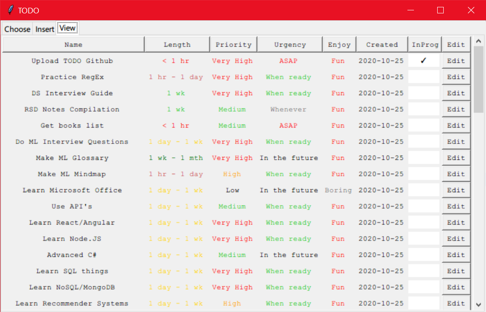
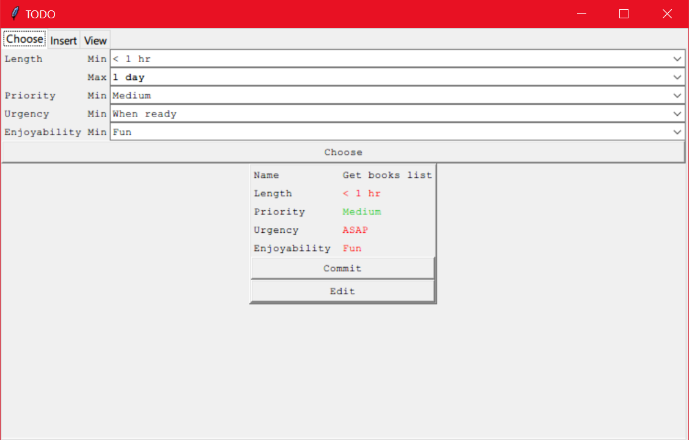

# TODO-Tracker
This was written for my personal use case, but feel free to use or extend it.




# Use Case
The goal of this script is to remain as simple and barebones as possible to eliminate any learning curve compared to, e.g., Evernote, to allow easy extension of the script, as well as enhance the specific use case of planning long-term projects.

# Features
This allows you to insert tasks into a local database (.csv), with options for a name, description, estimated length, priority, urgency, and enjoyability. You can then view a color-coded spreadsheet comparing and sorting tasks. Finally, you can automatically choose a task randomly by specifying the constraints.

# How to Install
You can run the script directly using Python. This was tested on Python 3.7.9. You'll also need to install the ```pandas``` package using pip or anaconda.
